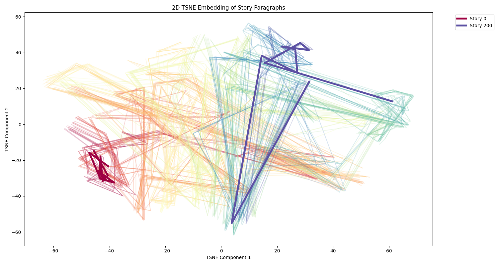

# LLM Fixpoints Explorer

## Description
This project explores how stories retold by LLMs develop over time and investigates if there are fixpoints where stories converge. The LLMs used in this project will be hosted locally using Ollama.

## Architecture

The project follows a modular architecture with the following components:
- `Application`: Main orchestrator of the process
- `UserInterface`: Interface for interacting with users (currently CLI-based)
- `LLMService`: Interface for interacting with language models (Ollama implementation provided)
- `StoryManager`: Manages story evolution and storage

See [src/architecture.md](src/architecture.md) for a detailed architecture diagram.

## Visualization
The project includes a visualization module that analyzes the evolution of stories using sentence embeddings. The visualization creates a 2D PCA embedding plot where each line represents a story, with paragraphs as points along the line. **This helps to visualize how stories evolve over multiple retellings** and if they converge towards common fixpoints.

To generate the visualization:
1. Ensure you have the required libraries installed (sentence-transformers, pandas, matplotlib)
2. Run the visualization script:

```python
# Generate story embeddings and visualization
cd src
poetry run python visualize_stories.py
```

The script will create a plot named `story_embedding.png` showing the 2D PCA embedding of all stories.
Here is an example:




## Installation

To set up the project, follow these steps:

```bash
# Install dependencies
poetry install
```

## Usage

Run the main application to start exploring LLM story fixpoints:

```python
# Run the main app
cd src
poetry run python app.py
```

You can also run a test script that demonstrates the application without user interaction:

```python
# Run the test script
cd src
poetry run python test_app.py
