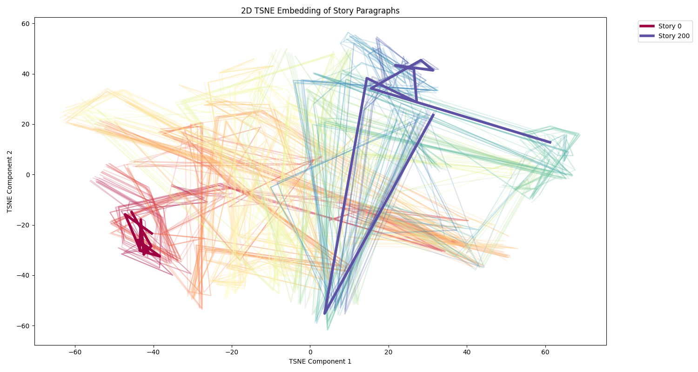

# Emergent Narrative Attractors in Iterated LLM Retellings

## Summary
This project explores how Large Language Models (LLMs) converge toward narrative attractors when iteratively re-telling stories. A simple experimental loop shows that, regardless of starting conditions, repeated re-tellings by an LLM often lead to semantically similar, stylized narratives—especially of inspirational or poetic tone.

---

## Experimental Setup
- **Model**: `llama3.2 3B` used for generation.
- **Input**: Custom story built from seed elements (characters, setting).
- **Loop**:  
   1. Generate a story from the seed.  
   2. Prompt: *“Retell this story in your own words. Make it engaging.”*  
   3. Feed the new story back in; repeat for 200+ iterations.
- **Embedding**: Paragraphs embedded via `all-MiniLM-L6-v2`; visualized using t-SNE.

---

## Findings (So Far)
- Clear convergence in semantic space over time.
- Early paragraphs cluster tightly; later generations diffuse and drift.
- Stories often converge toward abstract or poetic narrative styles.
- Evidence of attractor dynamics akin to those in dynamical systems.

---

## Potential Directions
- **Quantitative**:  
   - Track convergence via cosine distance.  
   - Measure semantic drift via gradient flow in embedding space.  
   - Pairwise distance heatmaps of final paragraphs to expose attractor basins.
- **Perturbations**:  
   - Modify prompts (e.g., neutral, factual, structured).  
   - Inject controlled mutations or noise at each step.  
   - Vary model parameters (e.g., temperature).
- **Comparative**:  
   - Run parallel setups across different models (e.g., GPT-4, Mistral, Claude).  
   - Evaluate sensitivity of attractor formation across architectures.

---

## Why It’s Interesting
- Low-effort setup with visually striking results.
- Touches multiple research areas: representation learning, interpretability, language dynamics.
- Ideal for thesis-level exploration or a lightweight publication.

---

## Architecture

The project follows a modular architecture with the following components:
- `Application`: Main orchestrator of the process
- `UserInterface`: Interface for interacting with users (currently CLI-based)
- `LLMService`: Interface for interacting with language models (Ollama implementation provided)
- `StoryManager`: Manages story evolution and storage

See [src/architecture.md](src/architecture.md) for a detailed architecture diagram.

---

## Visualization
The project includes a visualization module that analyzes the evolution of stories using sentence embeddings. The visualization creates a 2D PCA embedding plot where each line represents a story, with paragraphs as points along the line. **This helps to visualize how stories evolve over multiple retellings** and if they converge towards common fixpoints.

To generate the visualization:
1. Ensure you have the required libraries installed (sentence-transformers, pandas, matplotlib)
2. Run the visualization script:

```python
# Generate story embeddings and visualization
cd src
poetry run python visualize_stories.py
```

The script will create a plot named `story_embedding.png` showing the 2D PCA embedding of all stories.
Here is an example:



---

## Installation

To set up the project, follow these steps:

```bash
# Install dependencies
poetry install
```

---

## Usage

Run the main application to start exploring LLM story fixpoints:

```python
# Run the main app
cd src
poetry run python app.py
```

You can also run a test script that demonstrates the application without user interaction:

```python
# Run the test script
cd src
poetry run python test_app.py
