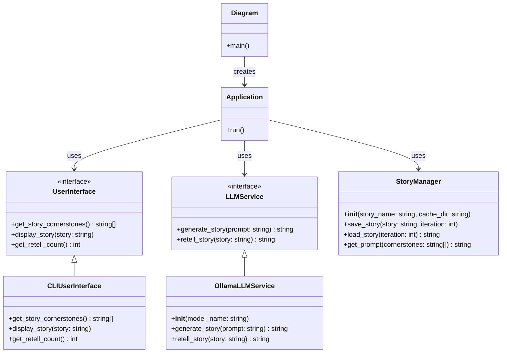

# LLM Fixpoints Explorer Architecture

This document outlines the architecture for the LLM Fixpoints Explorer project, which investigates how stories retold by LLMs develop over multiple iterations and if there are fixpoints where stories converge.

## Components

## Component Descriptions

### Application
The main orchestrator of the process:
- Gets story cornerstones from the user via `UserInterface`
- Creates a prompt using `StoryManager`
- Generates an initial story using `LLMService`
- Retells the story n times (where n is provided by the user)
- Saves each iteration of the story using `StoryManager`

### UserInterface
An interface for interacting with users:
- `get_story_cornerstones()`: Gets the corner stones of a story from the user
- `display_story(story)`: Displays a story to the user
- `get_retell_count()`: Gets the number of retellings from the user

### CLIUserInterface
Implements the `UserInterface` interface for command-line interaction.

### LLMService
An interface for interacting with language models:
- `generate_story(prompt)`: Generates a story based on a prompt
- `retell_story(story)`: Retells an existing story

### OllamaLLMService
Implements the `LLMService` interface using Ollama's API.

### StoryManager
Handles story management:
- Saving stories to files
- Loading stories from files
- Creating prompts from cornerstones

## Implementation Plan

1. Create the necessary directories and files:
   - src/ui/
     - cli.py
   - src/llm/
     - __init__.py
     - ollama_service.py
   - src/story/
     - __init__.py
     - manager.py

2. Implement each component according to the class diagram above.

3. Update app.py to use this new architecture.